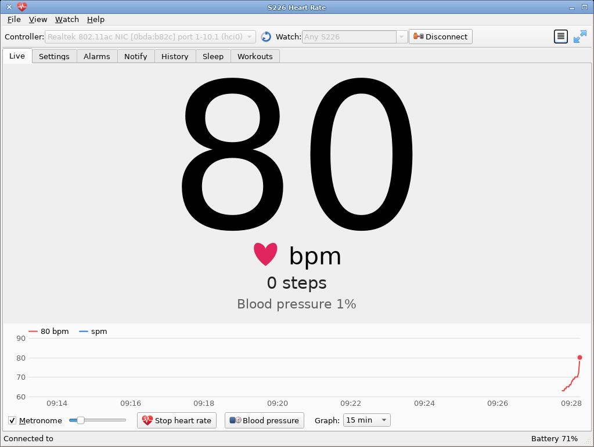

# S226 for Linux

Linux tools for the **S226 fitness watch** (H-Band / Veepoo), based on a
reverse-engineered Bluetooth LE protocol. No phone and no H-Band app are
needed.

- **`s226-hr`**: Qt GUI with tabs for live heart rate, settings, alarms,
  notifications (messages, calls, music / MPRIS, desktop notification
  forward), activity history, sleep and workouts. System tray; single
  instance by default.
- **`s226-cli`**: the same features in a terminal — heart rate or blood
  pressure, settings, alarms, messages, music metadata, history, sleep,
  weather status, contacts, workouts, and raw protocol access.
- **`s226ble`**: the C++20 library both are built on (libusb + minimal
  HCI/L2CAP/ATT host; no BlueZ).
- Python research tools and the protocol notes in [PROTOCOL.md](PROTOCOL.md)
  and [VeePoo_HBand_BLE_Protocol.md](VeePoo_HBand_BLE_Protocol.md).

```bash
nix run .#                      # s226-hr
nix run .#s226-cli -- --list    # show usable Bluetooth controllers
nix run .#s226-cli              # heart rate in the terminal (-v: protocol log, --bp: blood pressure)
```

Wake the watch by pressing its button so that it advertises; the tools
connect as soon as they see it.



## s226-hr

The window is organised as **tabs**. The toolbar always has controller
selection, watch address and Connect.

**Live** (default tab)

- **Heart rate** as a big number that scales with the window. The watch
  ends a measurement after ~30–50 s; the app restarts it automatically.
- **Steps today** and **cadence** in steps per minute (spm). The cadence
  is measured between the moments the watch's step counter changes
  (polled every second), so it follows the watch's own update rate and
  drops to 0 when you stop.
- **Graph** of bpm and spm over 1 min to 2 h (pick the span; hover for
  exact values).
- **Log**: every reading is appended to one CSV file per day,
  `~/.local/share/s226/s226-hr/s226-hr-YYYY-MM-DD.csv` (columns
  `time,bpm,spm`). The graph is refilled from it on restart.
- **Metronome** that clicks on every beat; the heart icon pulses along
  either way.
- **Start / Stop heart rate** for continuous measurement (starts on connect).
- **Blood pressure** measurement on demand.
- The status bar shows the watch's **battery** (hover for the firmware
  version).

**Settings** — sedentary reminder, heart-rate alarm, screen-on time,
brightness, countdown preset, watch face, personal data, **weather
status** (on/off), feature toggles (metric, 24h, auto-HR, stopwatch,
music, …) and which message types the watch shows. Refresh / Apply.

**Alarms** — list, add, edit and delete the alarms stored on the watch
(weekday picker for recurring alarms).

**Notify**

- Text messages (choose type; the type must be enabled under Settings).
- Incoming-call screen (ring / end).
- **Contacts**: edit a name/phone table and push (or clear) the list on the watch.
- **Music / now-playing**: push title, artist, album, play state and
  volume to the watch; media keys from the watch are shown in the tab.
- **MPRIS** (optional): forward those keys to the system media player;
  **From player** fills the form from the active player; **Push system
  track changes to the watch** keeps metadata in sync.
- **Desktop notifications**: forward
  `org.freedesktop.Notifications` to the watch as type `other`, with
  filters for urgency, transient/OSD hints, app name and category.

**History** — 5-minute activity slots for today or a previous day
(steps, distance, calories, activity, HR).

**Sleep** — sleep sessions for last night or a previous day (fall-asleep
/ wake times, deep and light minutes, quality, wakes, stage curve).

**Workouts** — sport-mode sessions with per-minute detail.

Connects on start (`--no-connect` to skip) and reconnects when the
watch drops out. Connects to any S226 by default; pick or type an
address in the **Watch** field (or pass `--address`). Watches you have
connected to before are listed there.

**Single instance** by default: a second start raises the existing
window (including restore from the tray) and exits. Use
`--multi-instance` for two watches or two controllers at once.

Closing the window hides to the **system tray** when one is available
(tooltip shows connection state and latest bpm). Restore from the tray
icon; **Quit** in the tray menu or **Ctrl+Q** exits fully.

Menu bar: **File** (connect, quit), **View** (log, full screen, metronome),
**Watch** (heart rate, blood pressure), **Help** (about).
Keys: **F11** / **Esc** full screen, **M** metronome, **Ctrl+L** log
panel, **Ctrl+Q** quit. Details are in `man s226-hr`.

## s226-cli

Without a command it prints the heart rate like `s226-hr`. Commands run in
order after connecting, print to stdout, and exit:

```bash
s226-cli --info --settings              # firmware, battery, settings
s226-cli --history=1 > yesterday.csv    # 5-minute slots (steps, HR, ...)
s226-cli --sleep=0                      # last night's sleep sessions
s226-cli --weather                      # read weather status
s226-cli --weather on                   # enable weather status
s226-cli --contacts 'Ada:+1555,Bob:+1566'  # push contacts
s226-cli --contacts ''                  # clear contact list
s226-cli --contact-delete 1
s226-cli --workouts                     # sport-mode sessions, per minute
s226-cli --alarms                       # list alarms on the watch
s226-cli --alarm 1=07:30/mon,tue,wed,thu,fri
s226-cli --sedentary 08:00-18:00/60 --hr-alarm 50-115 --screen-time 10
s226-cli --person 175,60,34,m,9000      # height, weight, age, sex, step goal
s226-cli --notify "Tea is ready"        # message on the watch
s226-cli --messages call,sms,other --notify-type sms --notify "Hi"
s226-cli --call "Alice"                 # incoming-call screen
s226-cli --music "Title/Artist/Album"   # now-playing on the watch
s226-cli --feature music=on             # enable music control if needed
s226-cli --feature stopwatch=off
s226-cli -v --send "a0 00"              # raw command, prints the replies
```

While connected without a command, media keys from the watch print as
`music: next`, `music: play-pause` or `music: previous`.

Details are in `man s226-cli`.

## Protocol surface (selected)

| Write | Meaning |
|-------|---------|
| `d0 01` / `d0 00` | start / stop heart rate |
| `d8 00` | today's activity totals |
| `a0 00` | battery |
| `d1 …` | daily history (5-minute slots) |
| `e0 0N` | sleep for day N (0 = last night); multi-frame, index 0 ends the day |
| `d4 0N` | workout in slot N (1–3) |
| `c8 02` / `c8 03` | weather status read / set |
| `72 01` multi-packet | contact list push (TLV records) |
| `0x99` multi-packet | now-playing metadata |
| `0x01` notify | music keys from the watch |

See [PROTOCOL.md](PROTOCOL.md) for captures and decoding notes, and
[VeePoo_HBand_BLE_Protocol.md](VeePoo_HBand_BLE_Protocol.md) for the
wider APK-derived command map.

## Build

Nix flake (recommended):

```bash
nix build .#s226-hr
nix run .
```

CMake + system packages: Qt 6 (Widgets, Multimedia, DBus), libusb-1.0,
dbus-1, C++20. See `flake.nix` for the exact dependency set used in CI-style
builds.

## License

Keep existing headers; prefer GPLv3+ / REUSE / SPDX for new files.
